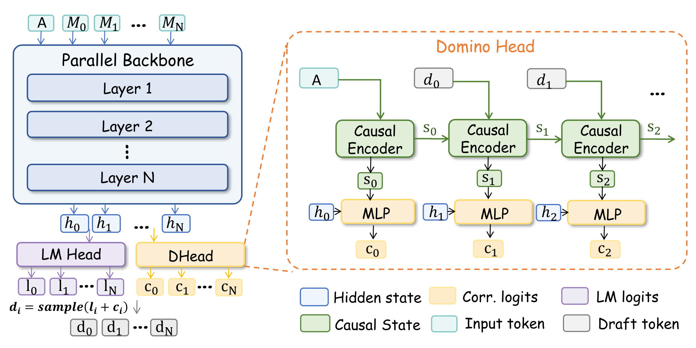

# Domino: Decoupling Causal Modeling from Autoregressive Drafting in Speculative Decoding
<p align="center">
  <a href="https://arxiv.org/abs/2605.29707"></a>
  <a href="https://huggingface.co/collections/Huang2020/domino"></a>
</p>
Domino is a speculative decoding method that keeps draft generation block-parallel while adding a lightweight causal correction head to improve draft-token acceptance.



## News

- [2026-05-30] 🔥🔥 Domino training code is now available in [SpecForge](https://github.com/sgl-project/SpecForge).
- [2026-05-29] 🔥 Domino paper released! Read the paper on [arXiv](https://arxiv.org/abs/2605.29707).

## Demo


## Supported Models

| Target model | Draft model |
| --- | --- |
| `Qwen3-4B` | [`Qwen3-4B-Domino-b16`](https://huggingface.co/Huang2020/Qwen3-4B-Domino-b16) |
| `Qwen3-8B` | [`Qwen3-8B-Domino-b16`](https://huggingface.co/Huang2020/Qwen3-8B-Domino-b16) |
| `Qwen3.6-35B-A3B` | Coming soon |
| `Qwen3.6-27B` | [`Qwen3.6-27B-Domino`](https://huggingface.co/Huang2020/Qwen3.6-27B-Domino) |

## Installation

```bash
uv pip install "git+https://github.com/jianuo-huang/sglang.git@feat/domino-tensor-parallel#subdirectory=python"
```

## Quick Usage

### SGLang

```bash
sglang serve \
  --model-path Qwen/Qwen3.6-27B \
  --speculative-algorithm DFLASH \
  --speculative-draft-model-path Huang2020/Qwen3.6-27B-Domino \
  --speculative-dflash-block-size 16 \
  --tp-size 2 \
  --trust-remote-code
```

### Transformers

The Transformers backend currently supports Qwen3 checkpoints. Use SGLang
above for Qwen3.6-27B.

```python
from transformers import AutoModel, AutoModelForCausalLM, AutoTokenizer

draft = AutoModel.from_pretrained(
    "Huang2020/Qwen3-8B-Domino-b16",
    trust_remote_code=True,
    torch_dtype="auto",
    device_map="cuda:0",
).eval()

target = AutoModelForCausalLM.from_pretrained(
    "Qwen/Qwen3-8B",
    torch_dtype="auto",
    device_map="cuda:0",
).eval()

tokenizer = AutoTokenizer.from_pretrained("Qwen/Qwen3-8B")
messages = [{
    "role": "user",
    "content": "How many positive whole-number divisors does 196 have?",
}]
input_ids = tokenizer.apply_chat_template(
    messages,
    return_tensors="pt",
    add_generation_prompt=True,
    enable_thinking=False,
).to(draft.device)

output = draft.spec_generate(
    input_ids=input_ids,
    target=target,
    max_new_tokens=2048,
    temperature=0.0,
    stop_token_ids=[tokenizer.eos_token_id],
)

generated = output[:, input_ids.shape[1]:]
print(tokenizer.decode(generated[0], skip_special_tokens=True))
```

## Hugging Face Benchmark

```bash
DRAFT_MODEL=Huang2020/Qwen3-8B-Domino-b16 \
TARGET_MODEL=Qwen/Qwen3-8B \
PYTHON=python \
./run_hf_benchmark.sh
```

Defaults:

- `TASKS=gsm8k:128`
- `MAX_NEW_TOKENS=2048`
- `TEMPERATURE=0.0`
- `BLOCK_SIZE=16`
- `NUM_GPUS=8`

Override tasks or runtime settings with environment variables:

```bash
TASKS="gsm8k:128,math500:128" NUM_GPUS=4 ./run_hf_benchmark.sh
```

## SGLang Benchmark

```bash
DRAFT_MODEL=Huang2020/Qwen3-8B-Domino-b16 \
TARGET_MODEL=Qwen/Qwen3-8B \
PYTHON=python \
./run_sglang_benchmark.sh
```

Defaults:

- `TASKS=gsm8k:128`
- `MAX_NEW_TOKENS=2048`
- `TEMPERATURE=0.0`
- `CONCURRENCIES=1,2,4,8,16,32`

Use these sample counts to reproduce the paper settings:

```bash
TASKS="gsm8k:128,math500:128,aime24:30,aime25:30,humaneval:164,mbpp:128,livecodebench:128,swe-bench:128,mt-bench:80,alpaca:128"
```

Override tasks or runtime settings with environment variables:

```bash
TASKS="mt-bench:80,alpaca:128" CONCURRENCIES=1 ./run_sglang_benchmark.sh
```

## Acknowledgements

We thank the authors and maintainers of [DFlash](https://github.com/z-lab/dflash), [SpecForge](https://github.com/sgl-project/SpecForge), [FlashInfer](https://github.com/flashinfer-ai/flashinfer), and [SGLang](https://github.com/sgl-project/sglang). Their open-source work on block-parallel speculative decoding, speculative-decoding training infrastructure, high-performance attention kernels, and LLM serving helped shape this project and its benchmarking setup.

## Citation

If you use Domino in your research, please cite:

```bibtex
@article{huang2026domino,
  title={Domino: Decoupling Causal Modeling from Autoregressive Drafting in Speculative Decoding},
  author={Huang, Jianuo and Zhang, Yaojie and Zhang, Qituan and Lin, Hao and Xu, Hanlin and Zhang, Linfeng},
  journal={arXiv preprint arXiv:2605.29707},
  year={2026},
  eprint={2605.29707},
  archivePrefix={arXiv},
  primaryClass={cs.CL},
  doi={10.48550/arXiv.2605.29707},
  url={https://arxiv.org/abs/2605.29707}
}
```
