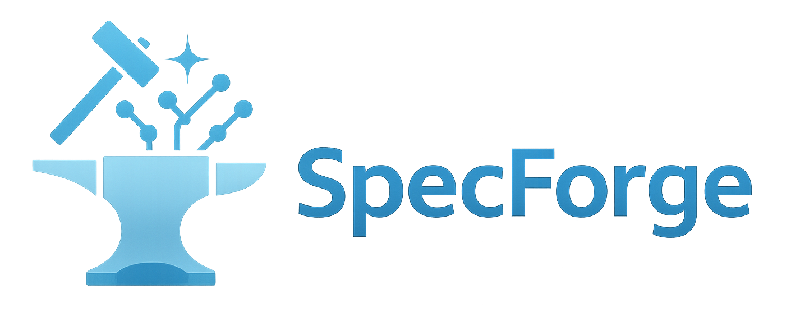

<div align="center" id="sglangtop">
</img>

[](https://docs.sglang.io/SpecForge/)
[](https://huggingface.co/collections/lmsys/specbundle)
[![DeepWiki](https://img.shields.io/badge/DeepWiki-SpecForge-blue.svg?logo=data:image/png;base64,iVBORw0KGgoAAAANSUhEUgAAACwAAAAyCAYAAAAnWDnqAAAAAXNSR0IArs4c6QAAA05JREFUaEPtmUtyEzEQhtWTQyQLHNak2AB7ZnyXZMEjXMGeK/AIi+QuHrMnbChYY7MIh8g01fJoopFb0uhhEqqcbWTp06/uv1saEDv4O3n3dV60RfP947Mm9/SQc0ICFQgzfc4CYZoTPAswgSJCCUJUnAAoRHOAUOcATwbmVLWdGoH//PB8mnKqScAhsD0kYP3j/Yt5LPQe2KvcXmGvRHcDnpxfL2zOYJ1mFwrryWTz0advv1Ut4CJgf5uhDuDj5eUcAUoahrdY/56ebRWeraTjMt/00Sh3UDtjgHtQNHwcRGOC98BJEAEymycmYcWwOprTgcB6VZ5JK5TAJ+fXGLBm3FDAmn6oPPjR4rKCAoJCal2eAiQp2x0vxTPB3ALO2CRkwmDy5WohzBDwSEFKRwPbknEggCPB/imwrycgxX2NzoMCHhPkDwqYMr9tRcP5qNrMZHkVnOjRMWwLCcr8ohBVb1OMjxLwGCvjTikrsBOiA6fNyCrm8V1rP93iVPpwaE+gO0SsWmPiXB+jikdf6SizrT5qKasx5j8ABbHpFTx+vFXp9EnYQmLx02h1QTTrl6eDqxLnGjporxl3NL3agEvXdT0WmEost648sQOYAeJS9Q7bfUVoMGnjo4AZdUMQku50McDcMWcBPvr0SzbTAFDfvJqwLzgxwATnCgnp4wDl6Aa+Ax283gghmj+vj7feE2KBBRMW3FzOpLOADl0Isb5587h/U4gGvkt5v60Z1VLG8BhYjbzRwyQZemwAd6cCR5/XFWLYZRIMpX39AR0tjaGGiGzLVyhse5C9RKC6ai42ppWPKiBagOvaYk8lO7DajerabOZP46Lby5wKjw1HCRx7p9sVMOWGzb/vA1hwiWc6jm3MvQDTogQkiqIhJV0nBQBTU+3okKCFDy9WwferkHjtxib7t3xIUQtHxnIwtx4mpg26/HfwVNVDb4oI9RHmx5WGelRVlrtiw43zboCLaxv46AZeB3IlTkwouebTr1y2NjSpHz68WNFjHvupy3q8TFn3Hos2IAk4Ju5dCo8B3wP7VPr/FGaKiG+T+v+TQqIrOqMTL1VdWV1DdmcbO8KXBz6esmYWYKPwDL5b5FA1a0hwapHiom0r/cKaoqr+27/XcrS5UwSMbQAAAABJRU5ErkJggg==)](https://deepwiki.com/sgl-project/SpecForge)

[](https://lmsys.org/blog/2025-07-25-spec-forge/)
[](https://sgl-fru7574.slack.com/archives/C09784E3EN6)
[](./LICENSE)

</div>

## 📍 Overview

SpecForge is an ecosystem project developed by the SGLang team. It is a framework for training speculative decoding models so that you can smoothly port them over to the SGLang serving framework to speed up your inference.

We have seen many open-source projects for speculative decoding, but most of them are not well-maintained or not directly compatible with SGLang. We prepared this project because we wish that the open-source community can enjoy a speculative decoding framework that is

- regularly maintained by the SpecForge team: the code is runnable out-of-the-box
- directly compatible with SGLang: no additional porting effort is required
- able to run online disaggregated training and both colocated and
  disaggregated offline training through one runtime, including the supported
  data, tensor, and sequence parallel topologies


Check out [**our documentation**](https://docs.sglang.io/SpecForge/) to get started.


## 🔧 Supported Methods

Every method uses the same typed training entry point:

```bash
specforge train --config examples/configs/online/disaggregated/external/qwen3-8b-eagle3-disaggregated.yaml
```

The path under `examples/configs` identifies feature mode, topology, and online
service ownership. The command above uses an `external` recipe: SpecForge
supervises the producer and consumer on one trainer node, while the user or
scheduler owns Mooncake and SGLang. Recipes under `managed-local` also start
those services on the local host. Online target parallelism belongs to SGLang;
`deployment.trainer` owns trainer DP and offline EAGLE3 USP process groups.
There are no method-specific Python training entry points.

| Method | Description | Example config | Optimization |
| --- | --- | --- | --- |
| **[EAGLE3](https://arxiv.org/abs/2503.01840)** | Feature-based autoregressive drafting | [Online external](./examples/configs/online/disaggregated/external/qwen3-8b-eagle3-disaggregated.yaml) / [Offline colocated](./examples/configs/offline/colocated/qwen3-8b-eagle3-offline.yaml) / [Offline disaggregated](./examples/configs/offline/disaggregated/qwen3-8b-eagle3-offline-disaggregated.yaml) | [LK loss](https://arxiv.org/pdf/2602.23881) |
| **[P-EAGLE](https://arxiv.org/abs/2602.01469)** | Parallel EAGLE | [Online external](./examples/configs/online/disaggregated/external/qwen3-8b-peagle-disaggregated.yaml) | — |
| **EAGLE3.1** | Feature-based autoregressive drafting with attention drift | [Online external](./examples/configs/online/disaggregated/external/qwen3-30b-a3b-eagle3.1-online.yaml) | — |
| **[DFlash](https://arxiv.org/abs/2602.06036)** | Block-parallel drafting | [Online external](./examples/configs/online/disaggregated/external/qwen3-8b-dflash-online.yaml) / [Offline colocated](./examples/configs/offline/colocated/qwen3-8b-dflash-offline.yaml) / [Online managed-local](./examples/configs/online/disaggregated/managed-local/qwen3-8b-dflash-1server-dp7-disaggregated.yaml) | [D-PACE](https://arxiv.org/abs/2605.18810) |
| **[DFlash2](https://inco.ai/blog/dflash2/)** | DFlash with grouped dynamic convolution and top-k path selection | [Online managed-local](./examples/configs/online/disaggregated/managed-local/qwen3.6-27b-dflash2-disaggregated.yaml) | [D-PACE](https://arxiv.org/abs/2605.18810)|
| **[Domino](https://arxiv.org/html/2605.29707v1)** | DFlash with GRU logit correction | [Online external](./examples/configs/online/disaggregated/external/qwen3-8b-domino-online.yaml) / [Offline colocated](./examples/configs/offline/colocated/qwen3-8b-domino-offline.yaml) / [Online managed-local](./examples/configs/online/disaggregated/managed-local/qwen3-8b-domino-multiserver-disaggregated.yaml) | — |
| **[DSpark](https://arxiv.org/abs/2607.05147)** | Confidence-Scheduled Semi-Autoregressive Generation | [Online external](./examples/configs/online/disaggregated/external/qwen3-4b-dspark-disaggregated.yaml) / [Offline colocated](./examples/configs/offline/colocated/qwen3-4b-dspark-offline.yaml) | — |

See the [training guide](./docs/sections/basic_usage/training.md) for the supported
method/topology matrix and the
[disaggregated guide](./docs/sections/basic_usage/disaggregated_training.md) for the
online/offline launch workflows. Unsupported combinations are rejected during
config validation or run assembly instead of falling back to an older trainer.


## 🚀 Accelerate with SpecBundle

SpecBundle is a collection of production-grade speculative decoding models that are released by the SpecForge team and our industry partners. They provide higher acceptance rate compared to the existing open-source checkpoints over a wide range of domains. Together with SGLang, you can experience up to 4x speedup for inference. Check out our resources below:


| Item | Link |
| --- | --- |
| 📝 Documentation | [Link](https://docs.sglang.io/SpecForge/specbundle.html) |
| 📊 Performance Dashboard | [Link](https://docs.sglang.io/SpecForge/specbundle.html#performance-dashboard) |
| 🤗 Hugging Face Collection | [Link](https://huggingface.co/collections/lmsys/specbundle) |


## 🎉 News
- [2026-08] 🔥 Added DFlash2 online training for DFlash draft models.
- [2026-08] 🎉 Released SpecBundle (phase 2) and SpecForge v0.3.0. Check out our blog at [LMSYS.org](https://www.lmsys.org/blog/2026-08-04-specforge-v0-3)
- [2026-07] 🚀 Day0 supported two flagship dspark draft model, [Inkling](https://huggingface.co/RadixArk/Inkling-DSpark-Preview) and [Kimi-K3](https://huggingface.co/RadixArk/Kimi-K3-DSpark).
- [2026-07] 🔥 Supported full disaggregation of training and inference in online training.
- [2026-07] 🔥 Added DSpark online training for DFlash draft models.
- [2026-06] 🔥 Added D-PACE as an optional loss for DFlash training.
- [2026-06] 🔥 Added Domino online training for DFlash draft models.
- [2026-01] 🔥 Added DFlash block-parallel online training with SGLang serving support.
- [2025-12] 🎉 Released SpecBundle (phase 1) and SpecForge v0.2.0. Check out our blog at [LMSYS.org](https://lmsys.org/blog/2025-12-23-spec-bundle-phase-1/)
- [2025-08] 🔔 SpecForge is listed as a [flagship project](https://lmsys.org/about/) in LMSYS. Congratulations to the SpecForge team!
- [2025-08] 🔥 SpecForge powered the Eagle3 draft model for GPT-OSS. Check out the blog at [LMSYS.org](https://lmsys.org/blog/2025-08-27-gpt-oss/)
- [2025-07] 🔥 SpecForge is released together with Llama4-Eagle3 checkpoints. Check out our blog at [LMSYS.org](https://lmsys.org/blog/2025-07-25-spec-forge/)

## ✨ Acknowledgements

</img>

We would like to express our sincere gratitude to the official EAGLE team, especially Hongyang Zhang and Yuhui Li, for their invaluable contributions and support. Our thanks also go to the NVIDIA team—particularly Avery H and Izzy Putterman—and to the Google team, especially Ying Wang, for their insightful discussions and generous assistance throughout the project.

We are especially grateful to Meituan for their strong backing and meaningful contributions, which played a vital role in driving this project forward.

This project has also been inspired by many outstanding open-source projects from the LLM community, including [EAGLE](https://github.com/SafeAILab/EAGLE), [BaldEagle](https://github.com/NickL77/BaldEagle), and [TensorRT-Model-Optimizer](https://github.com/NVIDIA/TensorRT-Model-Optimizer) and others. Their contributions and shared knowledge have greatly benefited our work.

## 💡 Special Thanks to Voltage Park

We would like to extend our sincere thanks to [Voltage Park](https://www.voltagepark.com/), our official infrastructure partner. As part of a formal collaboration with the SGLang team, Voltage Park provided critical GPU resources that empowered us to train and evaluate large-scale speculative decoding models efficiently and reliably. This partnership was instrumental in making SpecForge possible. We deeply appreciate Voltage Park’s mission to make cutting-edge AI infrastructure more accessible, and we look forward to continued collaboration as we push the boundaries of open-source LLM serving and optimization.

## 📃 Citation

```bibtex
@article{li2026specforge,
  title={{SpecForge}: A flexible and efficient open-source training framework for speculative decoding},
  author={Li, Shenggui and Wang, Chao and Zhu, Yikai and Wang, Yubo and Yin, Fan and Shi, Shuai and Chen, Yefei and Dong, Xiaomin and Chen, Qiaoling and Pan, Jin and others},
  journal={arXiv preprint arXiv:2603.18567},
  year={2026}
}

@misc{specforge2025,
  title={SpecForge: Train speculative decoding models effortlessly},
  author={Shenggui Li, Yikai Zhu, Chao Wang, Fan Yin, Shuai Shi, Yubo Wang, Yi Zhang, Yingyi Huang, Haoshuai Zheng, Yineng Zhang},
  year={2025},
  publisher={GitHub},
  howpublished={\url{https://github.com/sgl-project/specforge}},
}
```
