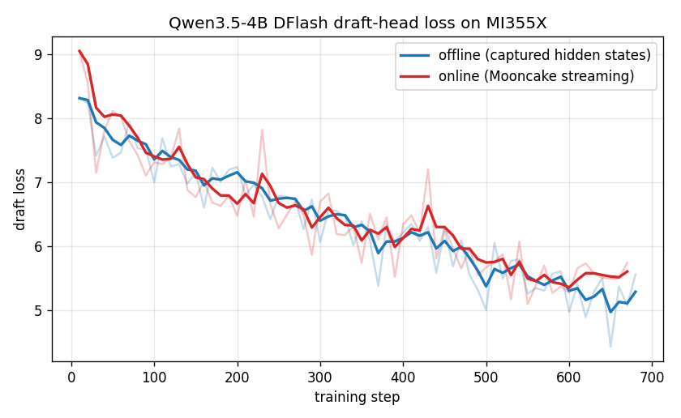
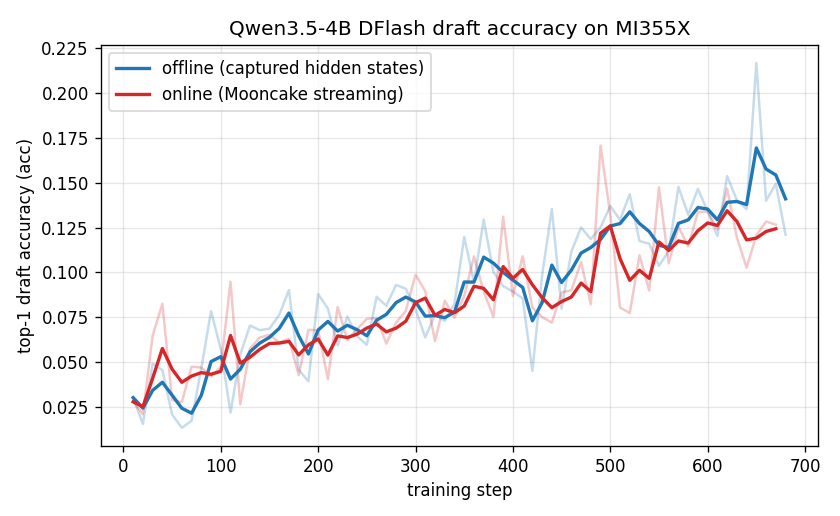
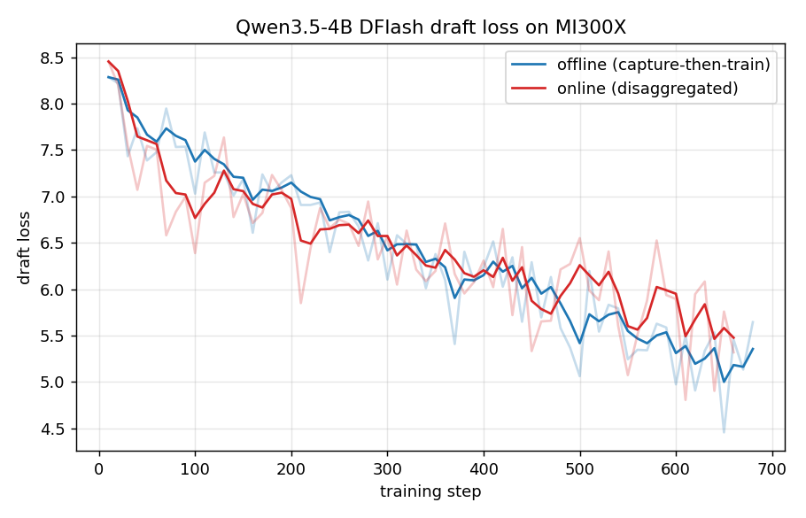
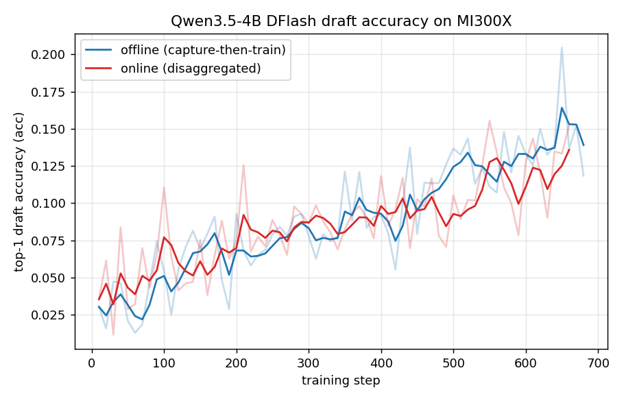

# AMD ROCm Tutorial

This is an end-to-end tutorial for running SpecForge on AMD Instinct GPUs
(ROCm). It walks through **installation → data preparation → offline colocated
training → online disaggregated training**. Within the online workflow, it
covers external services under one supervisor, the managed-local shortcut, and
external producer/consumer roles split across process pools or nodes.

All commands assume a ROCm host with the AMD driver stack and Docker already
installed. Validated on MI300X (gfx942) and MI355X (gfx950).

---

## 1. Installation

On ROCm, install SpecForge into an environment that already provides a ROCm
PyTorch and a ROCm SGLang, and install the package **without dependencies** so
pip does not pull CUDA wheels over the working ROCm stack.

The recommended base is an official SGLang ROCm release container. These ship a
ROCm PyTorch and an editable ROCm SGLang build, so SpecForge only needs to be
cloned and installed on top.

### Step 1: Pull the image for your accelerator

The accelerator is baked into the tag, so use the image that matches your
hardware:

```bash
# AMD Instinct MI300X (gfx942)
docker pull lmsysorg/sglang:v0.5.18-rocm720-mi30x

# AMD Instinct MI355X (gfx950)
docker pull lmsysorg/sglang:v0.5.18-rocm700-mi35x
```

### Step 2: Start the container

Expose the ROCm device nodes (swap in the tag for your accelerator). Use `--name`
and omit `--rm` so the checkout survives across sessions:

```bash
docker run -it --name specforge \
  --device=/dev/kfd --device=/dev/dri \
  --group-add video --cap-add SYS_PTRACE --security-opt seccomp=unconfined \
  --ipc=host --shm-size=16g \
  lmsysorg/sglang:v0.5.18-rocm720-mi30x \
  bash
```

`--device=/dev/kfd --device=/dev/dri --group-add video` are required for ROCm
GPU access; `--ipc=host --shm-size=16g` gives Mooncake and PyTorch enough shared
memory. Re-enter the running container later with `docker exec -it specforge bash`.

### Step 3: Clone and install SpecForge

Inside the container, clone SpecForge into `/workspace/SpecForge` and register it
in editable mode without touching the image's torch/sglang:

```bash
git clone https://github.com/sgl-project/SpecForge.git /workspace/SpecForge
cd /workspace/SpecForge
python -m pip install -e . --no-deps
```

`--no-deps` is mandatory: a full resolve pulls the CUDA SGLang stack and
clobbers the image's ROCm torch/sglang. If a later step reports a missing
lightweight dependency (for example `accelerate`), install just that package,
also with `--no-deps`.

### Step 4: Apply the capture patch (online runs only)

These images pin SGLang to exactly `0.5.18` (editable at `/sgl-workspace/sglang`),
so the online capture patch applies with a plain `git apply`. Skip this step for
offline training, which reads features from disk and needs no capture service:

```bash
cd /sgl-workspace/sglang
git apply /workspace/SpecForge/patches/sglang/v0.5.18/spec-capture.patch
cd /workspace/SpecForge
```

The patch adds the `--enable-spec-capture`, `--spec-capture-method`, and
`--spec-capture-aux-layer-ids` server flags plus the `sglang.srt.spec_capture_sink`
module used by online capture.

### Step 5: Attention backends on ROCm

Use the `sdpa` or `flex_attention` attention backends for the **trainer** on
ROCm. The `fa` (flash-attn) and `usp` backends, and `yunchang`-based
Ulysses/Ring sequence parallel (`sp_ulysses_size` / `sp_ring_size` > 1), depend
on a CUDA flash-attn build; the single-GPU / data-parallel path never loads
`yunchang`, and selecting those backends raises a clear error. The checked-in
[`qwen3.5-4b-dflash-offline-amd.yaml`](https://github.com/sgl-project/SpecForge/blob/main/examples/configs/offline/colocated/qwen3.5-4b-dflash-offline-amd.yaml)
recipe already uses `flex_attention`, so it runs on ROCm unchanged as a
single-GPU offline DFlash example.

The **capture side** (the SGLang target that materializes hidden states, both
offline and online) has an extra ROCm requirement for Qwen3.5-4B, a hybrid
linear-attention/Mamba target: run it under **AITER** and disable the radix
cache. Section 3 covers this in detail.

---

## 2. Data preparation

Data preparation is platform independent — the same scripts run on ROCm. Write a
ShareGPT training set into `cache/dataset` from the repository root:

```bash
python scripts/prepare_data.py --dataset sharegpt
```

This produces `./cache/dataset/sharegpt_train.jsonl` in the stable
`id` + `conversations` contract used by every checked-in recipe. For the full
preset list, custom datasets, preformatted text, and target-model regeneration,
see the [Data Preparation](../data_preparation.md) guide.

---

## 3. Offline colocated training

Offline training reads target features from disk, so the trainer only has to fit
the draft model. It uses more storage but keeps target inference out of the
training loop, and needs no capture patch or Mooncake. This section trains a
**Qwen3.5-4B DFlash** draft (`configs/qwen3.5-4b-dflash.json`).

### Step 1: Capture hidden states

Feature preparation is a data-processing step, not a second training entry point.
Qwen3.5-4B is a hybrid linear-attention/Mamba target, so run the capture under
**AITER** and pass `--sglang-disable-radix-cache`. Without it, SGLang's Mamba
radix cache selects the `extra_buffer` strategy, which asserts CUDA/MUSA/NPU
(FLA) at server init and fails on ROCm:

```bash
SGLANG_USE_AITER=1 SGLANG_USE_AITER_UNIFIED_ATTN=1 AITER_FLYDSL_FORCE=1 \
torchrun --standalone --nproc_per_node 1 \
  scripts/prepare_hidden_states.py \
  --target-model-path Qwen/Qwen3.5-4B \
  --strategy dflash \
  --draft-model-config configs/qwen3.5-4b-dflash.json \
  --trust-remote-code \
  --data-path ./cache/dataset/sharegpt_train.jsonl \
  --output-path ./cache/hidden_states/qwen3.5-4b-dflash-sharegpt \
  --chat-template qwen3.5 \
  --max-length 2048 \
  --tp-size 1 \
  --batch-size 8 \
  --sglang-attention-backend aiter \
  --sglang-disable-radix-cache \
  --sglang-mem-fraction-static 0.8 \
  --sglang-context-length 2560
```

The output path matches `data.hidden_states_path` in the checked-in offline
recipe. See [Data Preparation](../data_preparation.md#option-2-pre-formatted-text-format)
for preformatted inputs and other options.

> **Data note:** `prepare_hidden_states.py` truncates each rendered conversation
> at `max_length`. A long prompt can push the assistant reply past the cutoff,
> leaving an empty loss region (fewer than two anchorable tokens), which trips
> DFlash's anchor sampler (`ValueError: should preprocess the data.`). Drop the
> captured samples with `< 2` loss-mask tokens before the last `block_size`
> positions before training. The online path (Section 4) never hits this — its
> producer regenerates full-length responses.

### Step 2: Train

The checked-in offline recipe already uses `flex_attention` for the trainer, so
it runs on ROCm unchanged:

```bash
specforge train --config examples/configs/offline/colocated/qwen3.5-4b-dflash-offline-amd.yaml
```

Override any field inline without copying the YAML, e.g. a quick smoke run:

```bash
specforge train --config examples/configs/offline/colocated/qwen3.5-4b-dflash-offline-amd.yaml \
  training.max_steps=20 output_dir=./outputs/dflash-offline-smoke
```

See the [Training](../training.md) guide for the full run schema,
checkpoint/resume rules, and evaluation.

### Optional: Offline disaggregated deployment

The walkthrough above is offline colocated: the trainer reads prepared feature
files directly. If a producer must ingest those files for a separate trainer
pool, choose a recipe under
[`examples/configs/offline/disaggregated/`](https://github.com/sgl-project/SpecForge/tree/main/examples/configs/offline/disaggregated).
The feature source remains offline; only the deployment topology changes. This
path does not start SGLang. A `shared_dir` backend requires storage visible to
the producer and consumers, while a Mooncake backend requires an existing
Mooncake deployment. See
[Offline shared-directory and Mooncake stores](../disaggregated_training.md#offline-shared-directory-and-mooncake-stores)
for the complete contract.

---

## 4. Online disaggregated training

Online training captures target features live from a patched SGLang server and
streams them through Mooncake to the trainer. Every online run is
**disaggregated**: a producer drives prompts through the capture server and a
consumer trains the draft model. The choices below change service ownership and
process placement; they do not create additional training modes.

### External services with a single-node supervisor

With `deployment.trainer.nnodes: 1` and no `--role`, one `specforge train`
command supervises the producer and consumer. Mooncake and SGLang remain
external services started by the user.

This section uses the external
[`qwen3.5-4b-dflash-online-amd.yaml`](https://github.com/sgl-project/SpecForge/blob/main/examples/configs/online/disaggregated/external/qwen3.5-4b-dflash-online-amd.yaml)
recipe as a single-node smoke test. `external` means that the user starts
Mooncake and SGLang; the services still run locally in this example. Complete
Step 4 of the installation first.

#### Step 1: One-time run inputs

DFlash needs **no shared vocabulary mapping** (that is an EAGLE3-only
requirement, where a reduced draft vocabulary must be derived once and shared by
producer and consumer). DFlash keeps the full vocabulary and derives its target
signal from the draft's `target_layer_ids`, so there is nothing to precompute.

Qwen3.5-4B is also a large sharded checkpoint that already ships a
`*.index.json` weight map and a resolvable head, so it needs no local target
directory or index workaround. Just make sure `cache/dataset/sharegpt_train.jsonl`
exists (Section 2).

#### Step 2: Start Mooncake and the capture server

Start the Mooncake master. **Set `--default_kv_lease_ttl=500`**: the consumer's
teardown drain now allows about 19.5s for leases to settle, while the shorter
managed TTL keeps a normal shutdown from waiting several seconds for an expired
read lease.

```bash
mooncake_master --enable_http_metadata_server=true \
  --rpc_port=35551 --http_metadata_server_port=35880 \
  --metrics_port=35903 --enable_metric_reporting=false \
  --default_kv_lease_ttl=500 &
```

Start the patched capture server on GPU 0. **The `--spec-capture-aux-layer-ids`
must match the draft's `target_layer_ids`** — for DFlash these are read straight
from `configs/qwen3.5-4b-dflash.json`: `1 8 15 22 29` (this is not the EAGLE3
`[1, num_layers//2 - 1, num_layers - 4]` formula). A mismatch produces zero
features with no error. Because Qwen3.5-4B is a hybrid Mamba target, the server
must run under **AITER** with `--attention-backend aiter` and
`--disable-radix-cache` (see Section 3 for why):

```bash
SGLANG_USE_AITER=1 SGLANG_USE_AITER_UNIFIED_ATTN=1 AITER_FLYDSL_FORCE=1 \
HIP_VISIBLE_DEVICES=0 CUDA_VISIBLE_DEVICES=0 \
MOONCAKE_LOCAL_HOSTNAME=127.0.0.1 \
MOONCAKE_METADATA_SERVER=http://127.0.0.1:35880/metadata \
MOONCAKE_MASTER_SERVER_ADDR=127.0.0.1:35551 \
MOONCAKE_PROTOCOL=tcp \
MOONCAKE_GLOBAL_SEGMENT_SIZE=$((32<<30)) \
python -m sglang.launch_server \
  --model-path Qwen/Qwen3.5-4B \
  --trust-remote-code \
  --skip-tokenizer-init \
  --tp-size 1 \
  --context-length 4096 \
  --mem-fraction-static 0.8 \
  --attention-backend aiter \
  --chunked-prefill-size -1 \
  --disable-radix-cache \
  --enable-spec-capture --spec-capture-method dflash \
  --spec-capture-aux-layer-ids 1 8 15 22 29 \
  --host 127.0.0.1 --port 30000 &
```

Wait for `curl --fail http://127.0.0.1:30000/health` to return 200 (the first
health check can take a few minutes while AITER kernels compile).
`--context-length` must exceed `data.max_length` (2048) or `/generate` returns
`400 input longer than context length`.

#### Step 3: Launch training

One command supervises producer and consumer on GPU 1:

```bash
CUDA_VISIBLE_DEVICES=1 HIP_VISIBLE_DEVICES=1 \
MOONCAKE_LOCAL_HOSTNAME=127.0.0.1 \
MOONCAKE_METADATA_SERVER=http://127.0.0.1:35880/metadata \
MOONCAKE_MASTER_SERVER_ADDR=127.0.0.1:35551 \
MOONCAKE_PROTOCOL=tcp \
MOONCAKE_GLOBAL_SEGMENT_SIZE=$((32<<30)) \
specforge train -c examples/configs/online/disaggregated/external/qwen3.5-4b-dflash-online-amd.yaml \
  training.max_steps=20 training.num_epochs=1 \
  training.save_interval=20 training.log_interval=5
```

The trainer needs no AITER env — it runs `flex_attention` on ROCm; only the
capture server (Step 2) drives the Mamba target. Before rerunning, clear stale
control state: `rm -rf outputs/qwen3.5-4b-dflash-online`.

#### Success criteria

- Producer log: `drive_producer returning produced=<N> prompts_failed=0`.
- Consumer log: `step N: {...loss..., acc...}` lines, and **no**
  `could not drain` error or traceback at teardown.
- Checkpoint: `outputs/qwen3.5-4b-dflash-online/qwen3.5-4b-dflash-online-step20/`
  contains `training_state.pt` and `training_state_rank0.pt`.

> If `produced=0`, the capture aux-layer ids do not match the producer contract
> (see Step 2). If training succeeds but teardown reports `could not drain`, the
> Mooncake lease TTL is above the drain window (see Step 2).

### Managed-local shortcut

Instead of starting Mooncake and the capture server by hand, a
`deployment.disaggregated.managed_local` block lets one `specforge train`
command own those local processes and derive their endpoints. It defaults
`default_kv_lease_ttl_ms` to 500, so the lease-TTL fix is applied automatically.
Managed-local owns one local process tree and cannot be launched with
`--role producer` or `--role consumer` or split across nodes.
See [Multi-server capture](../disaggregated_training.md#multi-server-capture)
for the managed-local profile.

### Split an external run across process pools or nodes

This is the split-pool form of the external workflow above, not another
training mode. Both roles must use the same resolved run contract, but each is
launched explicitly:

```bash
# Inference / capture pool
specforge train -c examples/configs/online/disaggregated/external/qwen3.5-4b-dflash-online-amd.yaml --role producer

# Trainer pool
specforge train -c examples/configs/online/disaggregated/external/qwen3.5-4b-dflash-online-amd.yaml --role consumer
```

The checked-in AMD recipe is a single-node example and deliberately uses
`127.0.0.1`. For separate hosts, copy it to `run.yaml` and replace the loopback
Mooncake and SGLang endpoints with addresses reachable by the relevant roles.
Keep these values consistent across the deployment:

| Shared run contract | Node-local values |
| --- | --- |
| `run_id`, data/training settings, `store_id`, capture contract, routable `server_urls`, and Mooncake metadata/master endpoints | `MOONCAKE_LOCAL_HOSTNAME` and GPU visibility |
| `control_dir`, visible to the producer and consumers unless an inbox relay is configured | `consumer_state_dir`, on reliable local storage for consumer rank 0 |
| `output_dir`, visible to every consumer rank, and the complete `deployment.trainer` topology | `--node-rank` on each consumer host |

For multiple consumer nodes, record `deployment.trainer.nnodes`,
`nproc_per_node`, `master_addr`, and `master_port` once in the config, then pass
only the node-local identity on each trainer host:

```bash
specforge train -c run.yaml --role consumer --node-rank 0   # trainer-0
specforge train -c run.yaml --role consumer --node-rank 1   # trainer-1
```

A fresh attempt requires fresh control and consumer-state directories, and every
capture server must use the same target model, revision, capture method, and
auxiliary layer ids — for this recipe `--spec-capture-method dflash` with aux ids
`1 8 15 22 29`, and on ROCm each must run under AITER with `--disable-radix-cache`
(see External services, Step 2). For external-service prerequisites, freshness
rules, multi-server capture, inbox relays, and resume, see the
[Disaggregated training](../disaggregated_training.md) guide.

---

## Reference results on MI355X

The offline and online paths were run end-to-end on a single AMD Instinct
**MI355X** (gfx950) inside the `lmsysorg/sglang:v0.5.14-rocm720-mi35x` container,
training a **Qwen3.5-4B DFlash** draft on ShareGPT. Qwen3.5-4B is a hybrid
linear-attention/Mamba target (`Qwen3_5ForConditionalGeneration`); its draft is a
5-layer DFlash head (`hidden_size=2560`, `block_size=16`,
`target_layer_ids=[1, 8, 15, 22, 29]`). Both runs used `max_length=2048`,
`chat_template=qwen3.5`, `batch_size=2`, `accumulation_steps=4`,
`learning_rate=6e-4`, `num_anchors=512`, `loss_decay_gamma=7`, a `flex_attention`
trainer, and ~10 epochs (~680 optimizer steps).

The SGLang side (offline capture and online capture server) runs the hybrid
Mamba target under **AITER** on ROCm — export
`SGLANG_USE_AITER=1 SGLANG_USE_AITER_UNIFIED_ATTN=1 AITER_FLYDSL_FORCE=1` and use
`--attention-backend aiter`. A ROCm-specific requirement: the target needs
the radix cache disabled (offline capture: `--sglang-disable-radix-cache`;
external online server: `--disable-radix-cache`; managed-local config:
`model.sglang_disable_radix_cache: true`). SGLang's Mamba radix cache
auto-selects the `extra_buffer` strategy, which asserts CUDA/MUSA/NPU (FLA) at
server init and fails on ROCm; disabling the radix cache bypasses that path.
Offline consumes hidden states captured to disk by
`prepare_hidden_states.py`; online consumes the same features streamed live
from the AITER capture server through Mooncake. Both paths converge together —
the online capture path reproduces offline quality on ROCm.

### Training loss



Draft loss falls from ~9 to ~5.6 over ~680 steps. Faint lines are raw per-step
values; bold lines are an exponential moving average.

### Draft accuracy



Top-1 draft-token accuracy (`acc`) — the training-time proxy for serving-time
acceptance — rises from ~0.03 to ~0.12–0.13 and the two paths track each other
closely.

### Summary

| Metric (final) | Offline | Online |
| --- | --- | --- |
| Draft loss (start → end) | 8.3 → 5.6 | 9.1 → 5.7 |
| Top-1 draft accuracy (`acc`) | ~0.12 (peak ~0.22) | ~0.13 (peak ~0.17) |
| Epochs / steps | 10 / 687 | 10 / 670 |

**Throughput** (single MI355X, `batch_size=2`, `max_length=2048`):

- **Offline** capture: the AITER server generated hidden states for 572 prompts
  (286 batches) in ~48 s (~8 batches/s). The GPU-local trainer then ran at
  ~0.3 steps/s — sequences up to 2,048 tokens on a 4B target are much heavier
  than a small draft at short context.
- **Online** trainer: ~1.3 steps/s end-to-end (670 steps in ~520 s) with the
  capture server on GPU 0 and the trainer on GPU 1. A single AITER capture server
  produced 5,410 prompts across 10 epochs with **0 failures** (~10 prompts/s);
  the single-command `managed_local` stack (Mooncake master + capture server +
  trainer) came up and tore down cleanly (`default_kv_lease_ttl_ms=500`).

> **Data note (offline only):** `prepare_hidden_states.py` truncates each rendered
> conversation at `max_length`. Long-prompt samples whose assistant reply is
> pushed past the cutoff end up with an empty loss region, i.e. fewer than two
> anchorable tokens, which trips DFlash's anchor sampler
> (`ValueError: should preprocess the data.`). Drop those captured samples (any
> with `< 2` loss-mask tokens before the last `block_size` positions) before
> training. The online path never hits this — its producer regenerates full-length
> responses, so every streamed sample has a non-empty loss region.

These numbers are a functional reference for a 4B DFlash draft on ROCm, not a
tuned performance benchmark — longer sequences and multi-GPU trainers scale
differently.

---

## Reference results on MI300X

The same **Qwen3.5-4B DFlash** recipe was reproduced end-to-end on a single AMD
Instinct **MI300X** (gfx942) inside the `lmsysorg/sglang:v0.5.14-rocm720-mi30x`
container, using identical hyperparameters (offline and online, `max_length=2048`,
`chat_template=qwen3.5`, `batch_size=2`, `accumulation_steps=4`,
`learning_rate=6e-4`, `num_anchors=512`, `loss_decay_gamma=7`, `flex_attention`
trainer, ~10 epochs). The ROCm requirements are the same as on MI355X: run the
hybrid Mamba target under **AITER**
(`SGLANG_USE_AITER=1 SGLANG_USE_AITER_UNIFIED_ATTN=1 AITER_FLYDSL_FORCE=1`,
`--attention-backend aiter`) and **`--disable-radix-cache`** to bypass the
`extra_buffer` Mamba radix-cache FLA assertion.

### Training loss



Draft loss falls from ~8.4 to ~5.4 over ~680 steps; faint lines are raw per-step
values, bold lines an exponential moving average.

### Draft accuracy



Top-1 draft-token accuracy (`acc`) climbs from ~0.02 to ~0.14, and the offline and
online paths converge to the same quality — matching the MI355X result.

### Summary

| Metric (final) | Offline | Online |
| --- | --- | --- |
| Draft loss (start → end) | 8.3 → 5.4 | 8.5 → 5.5 |
| Top-1 draft accuracy (`acc`) | ~0.14 (peak ~0.21) | ~0.14 (peak ~0.16) |
| Epochs / steps | 10 / 687 | 10 / 666 |

**Throughput** (single MI300X, `batch_size=2`, `max_length=2048`):

- **Offline** capture: the AITER server captured hidden states for all 572
  prompts; 21 truncated samples with an empty loss region were dropped (see the
  data note below), leaving 551 for training.
- **Online** trainer: 666 steps in ~858 s (~0.78 steps/s) with the capture server
  on GPU 0 and the trainer on GPU 1. A single AITER capture server produced 5,330
  prompts across 10 epochs with **0 failures** (~6 prompts/s) and streamed 15,990
  feature objects through Mooncake; the single-command `managed_local` stack came
  up and tore down cleanly (`default_kv_lease_ttl_ms=500`).

> **Data note (offline only):** identical to the MI355X run — the offline capture
> produced the same 21 empty-loss-region samples (mostly `max_length`-truncated
> conversations), which must be dropped before training or DFlash's anchor sampler
> raises `ValueError: should preprocess the data.`. The online path never hits this.

Results on MI300X track MI355X closely, confirming the ROCm DFlash flow (AITER +
`--disable-radix-cache`) is portable across gfx942 and gfx950.
